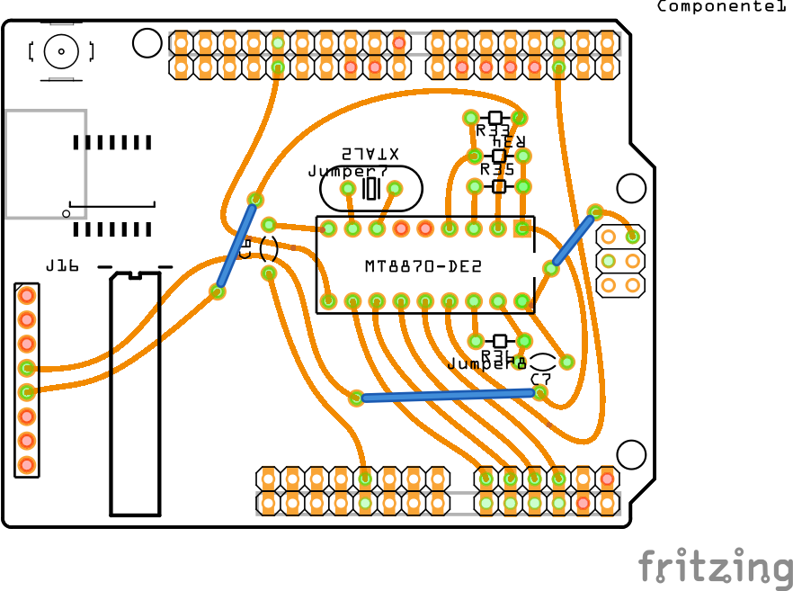

Esquemas dos circuitos para montagem via Shield do bina básico.

# Esquema do Shield

O esquema abaixo é do Shield, lembre-se que é preciso também a plaquinha de retificação de sinal e extração de audio que está logo a seguir:

# Retificador de Sinal e extração de Audio.

Para retificar o sinal telefonico e extrair o audio é preciso o circuito abaixo:

# Como montar