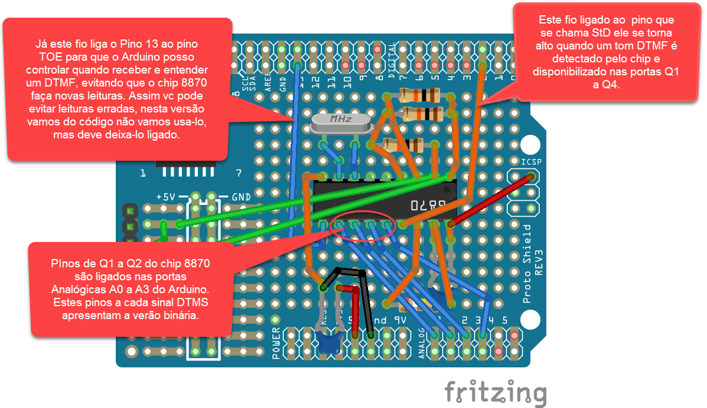

# Descrição dos pinos para montagem do SmartBina Shield

Aqui nesta página apresentarei apenas os detalhes básicos para entendimento do funcionamento do SmartBina Shield.

Para mais detalhes sobre o projeto do bina, vá na página  [Descrição do Bina e Seu Funcionamento](../descricao)

Abaixo está a imagem com as descrção dos pinos principais com relação ao Arduino e o que cada um deles faz.

Bem, nesta versão há apenas 3 sinalizações importantes, a primeira é a disponibilidade do dado obtido no código DTMF que é entregue pelos pinos Q1 a Q3, este pinos sempre apresentam um valor binário quando o chip MT8870 descobre um novo código DTMF válido.

Quando o valor está estável nos pinos Q, o pino StD se torna alto, portanto deve ser atachado uma interrupção ao pino D2 para que sempre que ouver tal interrupção ela leia nas portas A0 até A3 o valor binário.

Ao termino da leitura da sequência completa recebida antes do Toque é importante que seja desativada as portas Q, principalmente depois do atendimento telefonico, até que se deseje fazer uma nova leitura, por exemplo ao termino da ligação, e ignorar qualquer interrupção 

# O processo se resume:

 1 Sistema aguardando ligação
 2 o circuito alerta a chegada de um digito em DTMF
 3 o arduino recebe a interrupção gerada por StD e lê o sinal DTMF
 4 volta ao 2 até que seja composta a sequeência, se sequencia completa continua no passo 5 (é preciso verificar qual o tempo enviado entre DTMF e todo o DTMF da operadora.)
 5 desativa pinos Q enviando o sinal para a porta DOE
 6 envia para a porta serial a representação em string do DTMF recebido
 7 aguarda receber na porta serial um comando para que volte ao passo 1