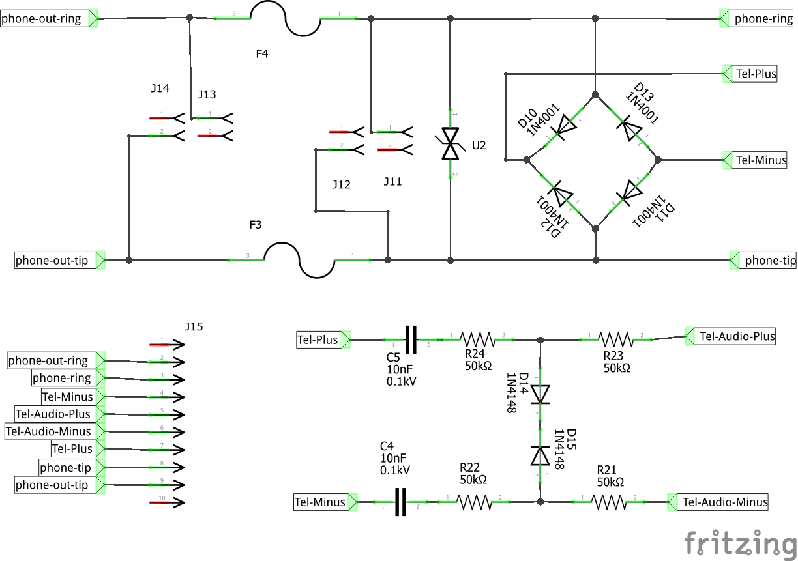

Esquemas dos circuitos para montagem via Shield do bina básico.

# Esquema do Shield

O esquema abaixo é do Shield, lembre-se que é preciso também a plaquinha de retificação de sinal e extração de audio que está logo a seguir:

# Retificador de Sinal e extração de Audio.

Para retificar o sinal telefonico e extrair o audio é preciso o circuito abaixo:

# Como montar

Faça o circuito da placa de [Retificação da sinalização](../Retificador de Sinal) com o processo de confeção que tem costume de fazer, fique atento a polaridade da sinalização.

Com um fone de ouvido de celular vc já pode ouvir o ruido da linha, tom de discagem, se alguém estivr na linha vc pode ouvir a conversa.

Lembre-se que tal uso é ilegal, e não autorizado pela operadora, isso deve ser usado apenas em testes, sugiro usar um PABX comum para os testes iniciais.

Em seguida faça o shield para obter a sinalização DTMF da Linha.