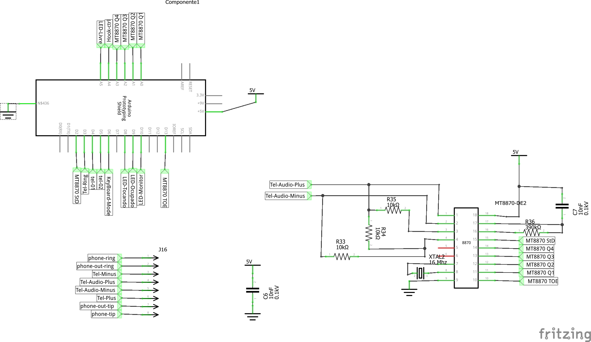
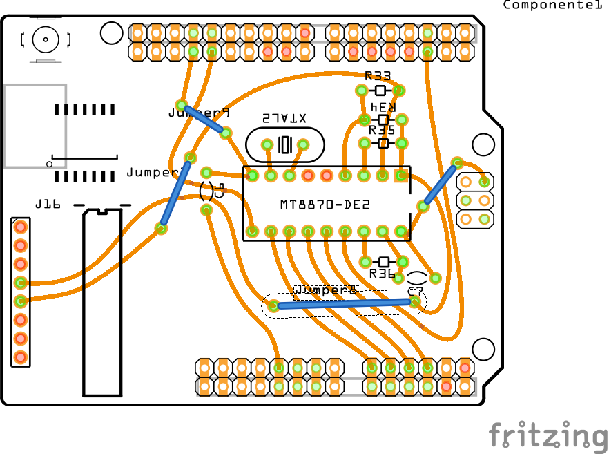

Esquemas dos circuitos para montagem via Shield do bina básico.

# Esquema do Shield

O esquema abaixo é do Shield, lembre-se que é preciso também a plaquinha de retificação de sinal e extração de audio que está logo a seguir:

# Retificador de Entrada e extração de Áudio.

Para retificar o sinal telefônico e extrair o áudio é preciso o circuito abaixo:

# Como montar

Faça o circuito da placa de [Retificação da sinalização](../Retificador de Sinal) com o processo de confecção que tem costume de fazer, fique atento a polaridade da sinalização.

Com um fone de ouvido de celular você já pode ouvir o ruido da linha, tom de discagem, se alguém estiver na linha você pode ouvir a conversa.

Lembre-se que tal uso é ilegal, e não autorizado pela operadora, isso deve ser usado apenas em testes, sugiro usar um PABX comum para os testes iniciais.

Em seguida faça o Shield para obter a sinalização DTMF da Linha.

# Lista de Peças

## Retificador de Entrada:

  * 1 x Placa Ilhada
  * 4 x 1N4001
  * 4 x 1N4148
  * 2 x Capacitor de 10nF 100v
  * 4 x Resitores de 50K 1/8W
  * 1 x S14K241 - 150VAC 
  * 2 x Porta fusível
  * 2 x fusível 500mA
  * 2 x RJ45
  * 1 x barra de pinos femea
  * Fios coloridos

## SmartBina Shield

 * 1 x Shield Arduino Arduino ilhado
 * 1 x MT8870 - Decoder DTMF
 * 2 x capacitor de 10nF x 100V
 * 3 x Resistor de 10KR x 1/8W
 * 1 x Resistor de 390KR x 1/8W
 * 1 x Cristal 3.579.545 Mhz
 * 1 x barra de pinos macho
 * Fios coloridos
